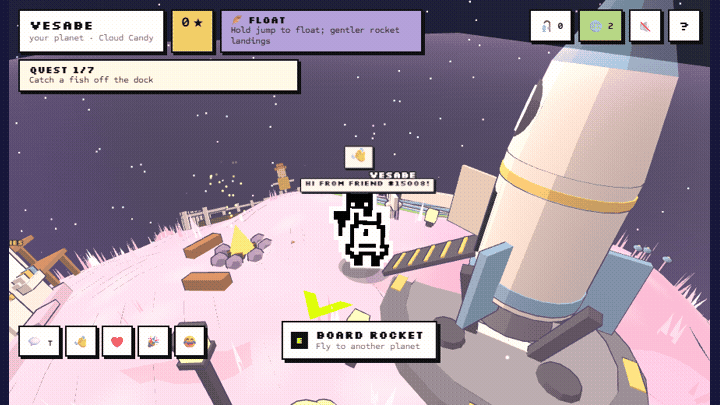
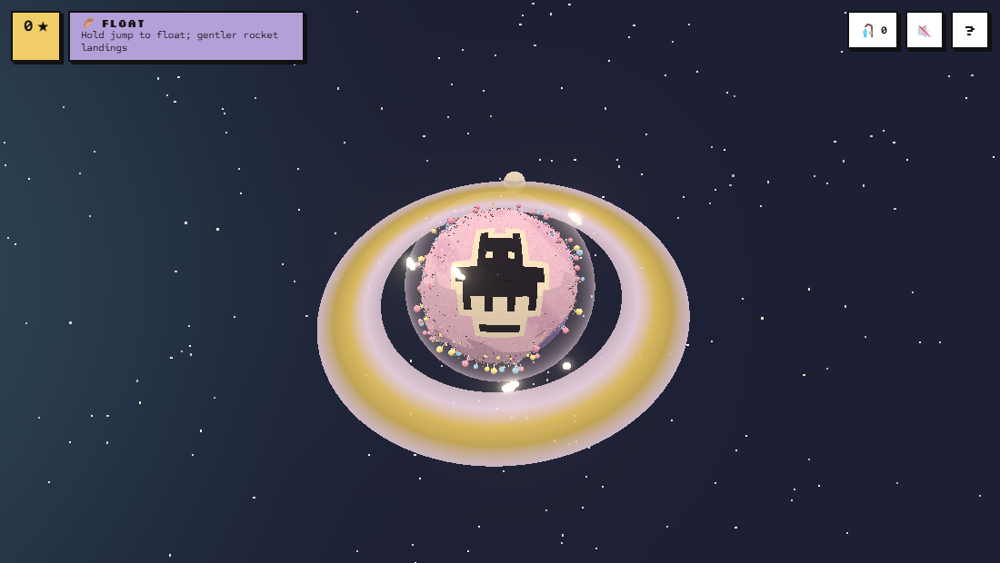
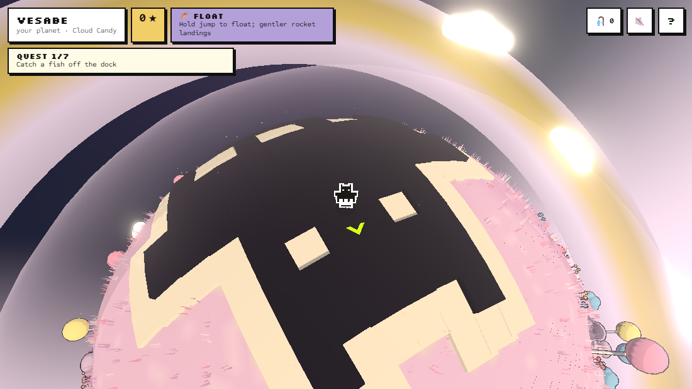
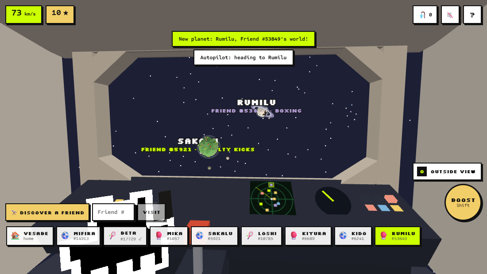
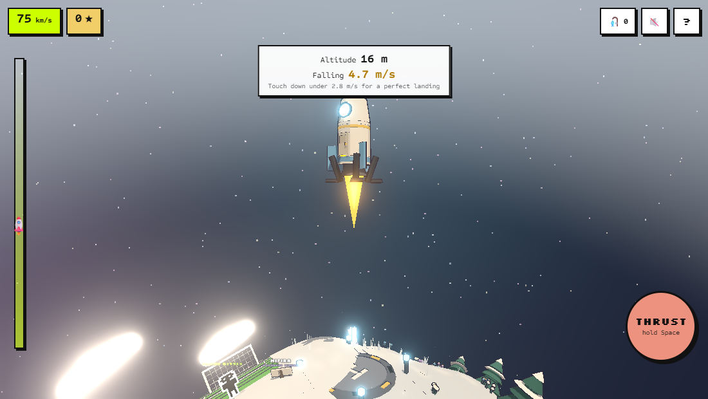
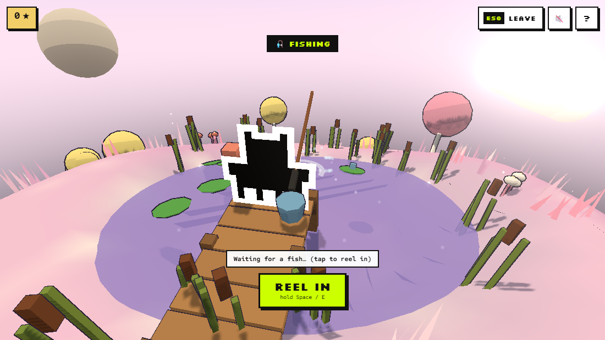
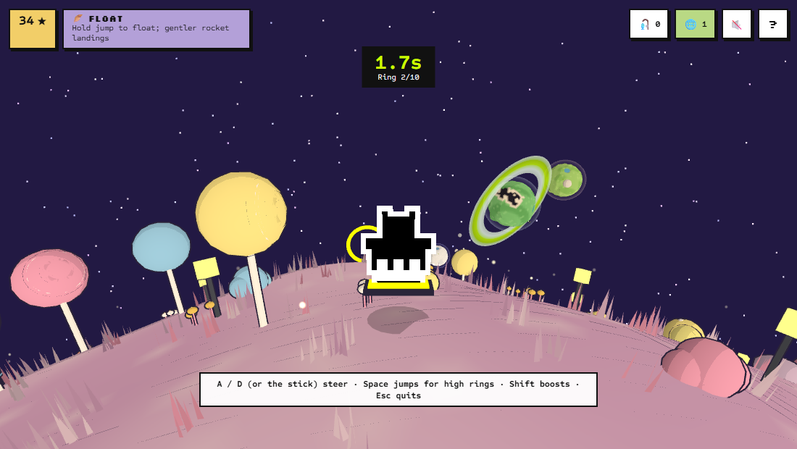
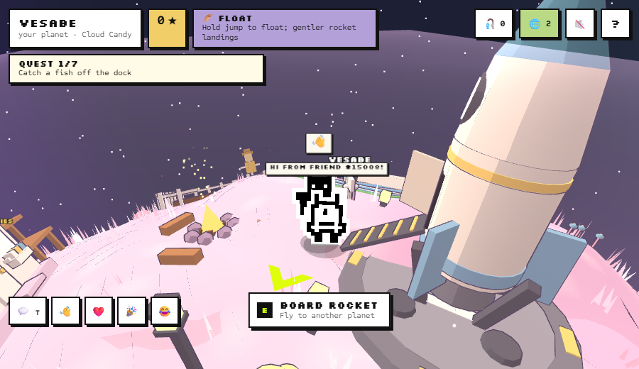

# Friend Planets 🪐

**Every Rare Friend is a planet.** Your Generations Friend's own on-chain pixels are raised across its tiny 3D planet as a giant portrait. Walk all the way around it, fly your rocket from the cockpit to other Friends' planets, land (softly), and play: fishing, farming, treasure, butterflies, a hoverboard ring race, and a sport against each planet's Friend. Everyone online shares the galaxy.

Rare Friends Vibeathon · **Character Spotlight** · FriendSDK **v0.1.4** · three.js · peer-to-peer online with Trystero.



🎮 **Play: https://bbczzzs.github.io/friend-planets/** requires a browser wallet on Robinhood mainnet (4663) holding a hardwired Rare Friends Generations NFT (gen ≥ 1): the SDK's standard gate. RF purchases are simulated in this preview: no RF, signature or transaction is used.

👀 **No wallet? About page with the trailer:** https://bbczzzs.github.io/friend-planets/preview/

🎬 [Trailer (MP4)](media/friend-planets-trailer.mp4)

| Your Friend is the planet | Standing on your own face | Cockpit | Landing burn |
|---|---|---|---|
|  |  |  |  |
| **Fishing fight** | **Boxing** | **Hoverboard ring race** | **Other players online** |
|  |  |  |  |

## In one minute

- **Your Friend's pixels are its planet**: the canonical 16×16 frame, black mask with the white halo, raised across the ground. You see it from space and on every landing, and you can walk across your own face.
- **Its family is its world and its perk**: 9 biomes (sky, trees, water, fish, crop, night glow, voice) and 9 perks that change how you play (Hoverers float, Colossus hits harder, Family grows crops twice as fast…).
- **Its token number is its planet**: name, size, layout, rings, moons and sport. The same Friend's planet is the same for everyone.
- **A galaxy of real Friends**: 16 planets to start, each belonging to a real Generations Friend; 🔭 Discover or type any token number to add more.
- **Fly it yourself**: walk up the ramp, 3-2-1 from the cockpit with your Friend at the controls, steer or use autopilot, then fly the landing burn.
- **Something to do everywhere**: fishing with a real fight, farming, treasure, butterflies, a ring race around the planet, and penalties, tennis or boxing against the planet's Friend.
- **Alive**: planet Friends wander, greet you in their family's voice and react to your matches; Friends you visit come to your campfire; a quest list and collection book guide you.
- **Online**: other players' Friends on your planet, chat and emotes, and a who's-online list that flies you to them. Peer to peer, no server, no wallet addresses shared.
- **Economy**: play to earn ★ Stars (catches, harvests, quests, sports, races, three daily tasks) and sell what you collect at the market; Stars buy bait, fertilizer, upgrades and starter looks. Premium hats, glowing auras and rocket paint cost RF through a wallet-style checkout (try it on first), and other players see them. The game never gives out RF; buying on another Friend's planet sends 10% to its owner. Fixed prices, no loot boxes. Hand-off for the Rare Friends team: [`ECONOMY.md`](ECONOMY.md).

Full rules, controls, checks and known issues: [`games/planets3d/README.md`](games/planets3d/README.md).

## Repository layout

- `index.html`, `game.*`, `runtime.*`, `layout.css`, `net.js`, `assets/`: the built static preview served by GitHub Pages
- `games/planets3d/`: the game (`index.tsx` UI; `src/engine.ts` world, rocket, landing, online; `planet.ts` planets and portraits; `activities.ts` fishing and sports; `extras.ts` treasure, butterflies and the ring race; `economy.ts` Stars, shop and orders; `payments.ts` where RF purchases connect; `tasks.ts` daily tasks; `aura.ts` auras; `look.ts` cel shading, outlines, grass, particles; `galaxy.ts`, `data.ts`, `progress.ts`, `net.ts`)
- `host/net.ts`: the online bridge that runs in the host page (the SDK keeps the game frame offline)
- `tools/add-net.mjs`: adds the online bridge to the build
- `test-interaction.mjs`: interaction test in the SDK's automated runtime
- `preview/`: the no-wallet about page · `media/`: trailer, GIF and screenshots

## Develop

```sh
npm install
npx friendsdk dev games/planets3d      # local preview (real wallet gate)
npm run build                           # dist/ (SDK build + online bridge)
npx tsc -p tsconfig.json && npx friendsdk check games/planets3d && node test-interaction.mjs 960
```

Publish: `npm run build`, copy `dist/*` to the repository root, push; GitHub Pages serves the root of `main`.

Credits: three.js (MIT), Trystero (MIT), the Steal An Egg FriendSDK example (Apache-2.0, camera/input/billboard patterns), fonts under the SIL OFL. Rare Friends artwork is read through FriendSDK and drawn unmodified.
